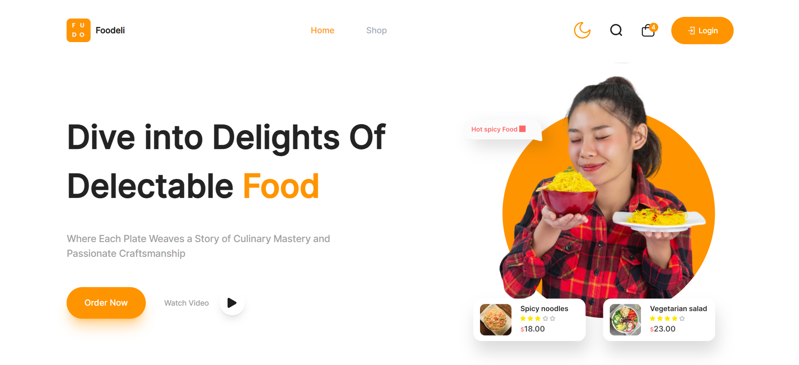

# • Foodeli App 🚀
This is a web application responsive project has been developed with React.js and some useful libraries.

 

<h2>• Technologies ⚙️ </h2>

Project is created with:

✨ React.js   

✨ TailwindCSS

✨ DaisyUi

✨ Typescript

✨ Swiper     

✨ Formik + Yup

✨ Zustand 

✨ React-Query

✨ React-Toastify

 

<h2>• Features Included 💡: </h2>

* Login
* Change Theme between Light and Dark
 

## • Project Demo 📷

 

## • Live Demo 🖥
Here is a working live demo :  [FoodeliApp](https://foodeli-app.vercel.app/)
